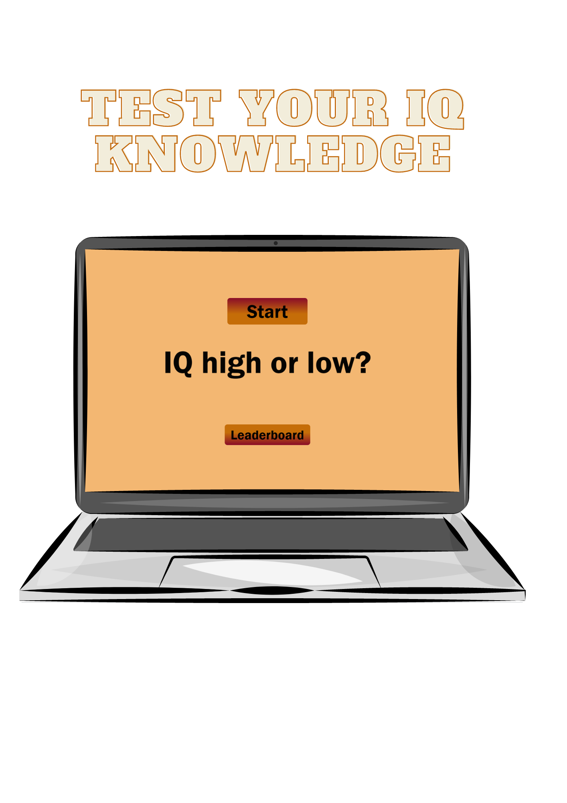
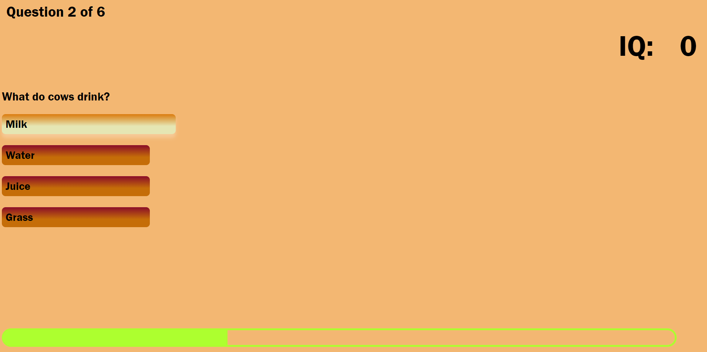

# Knowledge Quiz Game

This is a quiz web application called "Knowledge Quiz Game" which have mutiple quiz questions for the user to play and it have the option to display multiple choices and it display the right answer for the user and also placed their ranking depend on how well they did on the leaderboard system. This is a site that hopes to demonstrate how pure JavaScript works in a real-world context. This quiz game is for everyone as it is mostly contained common known question and its purpose is to educate user and its a fun interactive activity for any quiz nerds to test their IQ level. The Knowledge Quiz Game is a completely responsive JavaScript quiz game that aims to provide users with a wonderful and enjoyable interactive way to test their IQ knowledge and rank them on the leaderboard based on their IQ result.

## Features 

In this section, you should go over the different parts of your project, and describe each in a sentence or so. You will need to explain what value each of the features provides for the user, focusing on who this website is for, what it is that they want to achieve and how your project is the best way to help them achieve these things.

### Existing Features

- __The Knowledge Quiz Game Home Page__

  - The quiz description heading of "IQ high or not" is easily visible for all user as it is featured in the centre of the page. After landing and viewing the website, the visitor will get a description of the Quiz game as well as two buttons to start the quiz and view the leaderboard.

- __The Quiz Area__

  - This section will allow the user to play the quiz game.
  - The question section is where the user will be able to see the question to answer as part of the game. The user will be able answer the questions in the answer box provide. 
  - The user will be able to select the correct answer of the quiz, they will be playing by clicking on the answer button. 

- __The Leaderboard Area__

  - This section will allow the user to see the current leaderboard ranking. 

### Features Left to Implement

- Another feature idea

## Testing 

In this section, you need to convince the assessor that you have conducted enough testing to legitimately believe that the site works well. Essentially, in this part you will want to go over all of your project’s features and ensure that they all work as intended, with the project providing an easy and straightforward way for the users to achieve their goals.

In addition, you should mention in this section how your project looks and works on different browsers and screen sizes.

You should also mention in this section any interesting bugs or problems you discovered during your testing, even if you haven't addressed them yet.

If this section grows too long, you may want to split it off into a separate file and link to it from here.

### Validator Testing 

- HTML
    - No errors were returned when passing through the official [W3C validator]([https://validator.w3.org/nu/?doc=https%3A%2F%2Fcode-institute-org.github.io%2Flove-maths%2F](https://validator.w3.org/nu/?doc=https%3A%2F%2Fdulgisng.github.io%2FProject-2%2F)
- CSS
    - Two errors were found when passing through the official [(Jigsaw) validator](https://jigsaw.w3.org/css-validator/validator?uri=https%3A%2F%2Fdulgisng.github.io%2FProject-2%2F&profile=css3svg&usermedium=all&warning=1&vextwarning=&lang=en#css)
- JavaScript
    - No errors were found when passing through the official [Jshint validator](https://jshint.com/)
      - There are 7 functions in this file.
      - Function with the largest signature take 1 arguments, while the median is 1.
      - Largest function has 12 statements in it, while the median is 2.
      - The most complex function has a cyclomatic complexity value of 4 while the median is 1.

### Unfixed Bugs

You will need to mention unfixed bugs and why they were not fixed. This section should include shortcomings of the frameworks or technologies used. Although time can be a big variable to consider, paucity of time and difficulty understanding implementation is not a valid reason to leave bugs unfixed. 

## Deployment

This section should describe the process you went through to deploy the project to a hosting platform (e.g. GitHub) 

- The site was deployed to GitHub pages. The steps to deploy are as follows: 
  - In the GitHub repository, navigate to the Settings tab 
  - From the source section drop-down menu, select the Master Branch
  - Once the master branch has been selected, the page will be automatically refreshed with a detailed ribbon display to indicate the successful deployment. 

The live link can be found here - https://code-institute-org.github.io/love-maths/

## Credits 

In this section you need to reference where you got your content, media and extra help from. It is common practice to use code from other repositories and tutorials, however, it is important to be very specific about these sources to avoid plagiarism. 

You can break the credits section up into Content and Media, depending on what you have included in your project. 

### Content 

- The text for the Home page was taken from Wikipedia Article A
- Instructions on how to implement form validation on the Sign Up page was taken from [Specific YouTube Tutorial](https://www.youtube.com/)
- The icons in the footer were taken from [Font Awesome](https://fontawesome.com/)

### Media

- The photos used on the home and sign up page are from This Open Source site
- The images used for the gallery page were taken from this other open source site

Congratulations on completing your Readme, you have made another big stride in the direction of being a developer! 

## Other General Project Advice

Below you will find a couple of extra tips that may be helpful when completing your project. Remember that each of these projects will become part of your final portfolio so it’s important to allow enough time to showcase your best work! 

- One of the most basic elements of keeping a healthy commit history is with the commit message. When getting started with your project, read through [this article](https://chris.beams.io/posts/git-commit/) by Chris Beams on How to Write  a Git Commit Message 
  - Make sure to keep the messages in the imperative mood 

- When naming the files in your project directory, make sure to consider meaningful naming of files, point to specific names and sections of content.
  - For example, instead of naming an image used ‘image1.png’ consider naming it ‘landing_page_img.png’. This will ensure that there are clear file paths kept. 

- Do some extra research on good and bad coding practices, there are a handful of useful articles to read, consider reviewing the following list when getting started:
  - [Writing Your Best Code](https://learn.shayhowe.com/html-css/writing-your-best-code/)
  - [HTML & CSS Coding Best Practices](https://medium.com/@inceptiondj.info/html-css-coding-best-practice-fadb9870a00f)
  - [Google HTML/CSS Style Guide](https://google.github.io/styleguide/htmlcssguide.html#General)

Getting started with your Portfolio Projects can be daunting, planning your project can make it a lot easier to tackle, take small steps to reach the final outcome and enjoy the process! 
