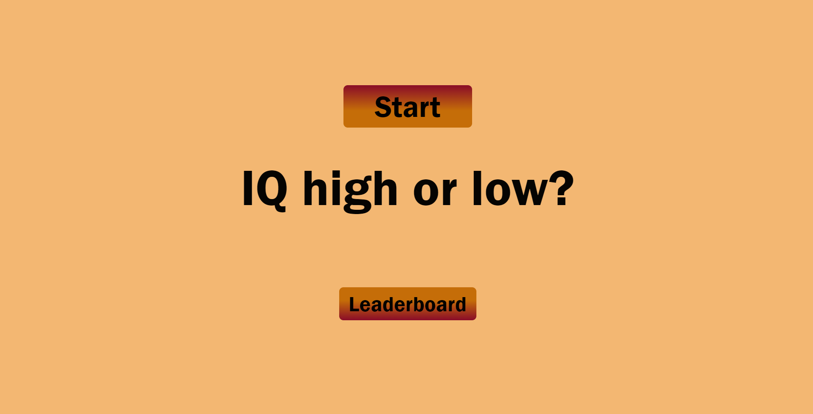
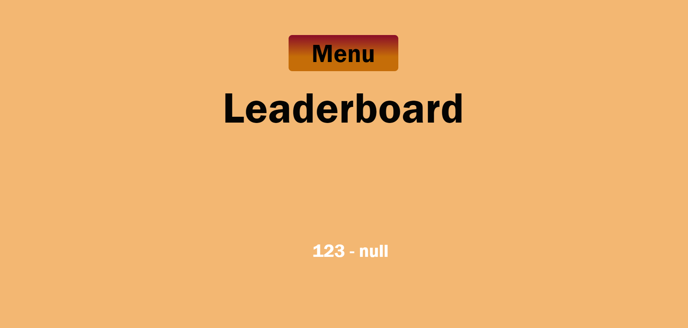

# Knowledge Quiz Game

This is a quiz web application called "Knowledge Quiz Game" which have mutiple quiz questions for the user to play and it have the option to display multiple choices and it display the right answer for the user and also placed their ranking depend on how well they did on the leaderboard system. This is a site that hopes to demonstrate how pure JavaScript works in a real-world context. This quiz game is for everyone as it is mostly contained common known question and its purpose is to educate user and its a fun interactive activity for any quiz nerds to test their IQ level. The Knowledge Quiz Game is a completely responsive JavaScript quiz game that aims to provide users with a wonderful and enjoyable interactive way to test their IQ knowledge and rank them on the leaderboard based on their IQ result.

## Features 

The main feature includes the main landing page, which features the option to begin the game and view the leaderboard. When the user clicks the start button, the game will begin with many questions and multiple buttons from which to select the correct answer. When the game is over, the player can check the leaderboard, which includes the results and their ranking. This site is ideal for individuals who want to test their IQ knowledge, and by taking our quiz, the user will be able to see if they have a broad knowledge base.

### Existing Features

- __The Knowledge Quiz Game Home Area__

  - The quiz description heading of "IQ high or not" is easily visible for all user as it is featured in the centre of the page. After landing and viewing the website, the visitor will get a description of the Quiz game as well as two buttons to start the quiz and view the leaderboard.
  - The button will changes colour to indicated that the mouse is pointing to the button to help guide with user navigation.

- __The Quiz Area__

  - This section will allow the user to play the quiz game.
  - The question section is where the user will be able to see the question to answer as part of the game. The user will be able answer the questions in the answer box provide. 
  - The user will be able to select the correct answer of the quiz, they will be playing by clicking on the answer button. 
  - Similar to the homepage feature the button will changes colour to indicated that the mouse is pointing to the button to help guide with user navigation.
  - At the bottom of the page, there is a green progress bar that shows how far the game has progressed.
  - There is also a scoreboard on the top right corner which add and counts the user score once they chosen the correct answer.

- __The Result Area__

- This section will allows the user to enter their name to see their result and see the current ranking on the leaderboard. 
- It display various button in which the user can decided if they want to try the game again or return back to the menu. 
- If the user decided to enter their name in the input and click submit they are able to see if their result is on the leaderboard ranking page.

- __The Leaderboard Area__

  - This section will allow the user to see the current leaderboard ranking. 

### Features Left to Implement

- Within the time restriction, add a timer to each question asked.
- We may also include a feature that informs the user if they have answered incorrectly and displays the correct answer.

## Testing 

In this section, you need to convince the assessor that you have conducted enough testing to legitimately believe that the site works well. Essentially, in this part you will want to go over all of your project’s features and ensure that they all work as intended, with the project providing an easy and straightforward way for the users to achieve their goals.

The website interface is easy to use and user can 

You should also mention in this section any interesting bugs or problems you discovered during your testing, even if you haven't addressed them yet.

If this section grows too long, you may want to split it off into a separate file and link to it from here.

### Validator Testing 

- HTML
    - No errors were returned when passing through the official [W3C validator](https://validator.w3.org/nu/?doc=https%3A%2F%2Fdulgisng.github.io%2FProject-2%2F)
- CSS
    - Two errors were found when passing through the official [(Jigsaw) validator](https://jigsaw.w3.org/css-validator/validator?uri=https%3A%2F%2Fdulgisng.github.io%2FProject-2%2F&profile=css3svg&usermedium=all&warning=1&vextwarning=&lang=en#css)
- JavaScript
    - No errors were found when passing through the official [Jshint validator](https://jshint.com/)
      - There are 7 functions in this file.
      - Function with the largest signature take 1 arguments, while the median is 1.
      - Largest function has 12 statements in it, while the median is 2.
      - The most complex function has a cyclomatic complexity value of 4 while the median is 1.

### Unfixed Bugs

The unfixed bugs are present in the last page of the website of the leaderboard ranking, where the final score ranking is being displayed as null and not the user's stored score.

## Deployment

- The site was deployed to GitHub pages. The steps to deploy are as follows: 
  - In the GitHub repository, navigate to the Settings tab 
  - From the source section drop-down menu, select the Master Branch
  - Once the master branch has been selected, the page will be automatically refreshed with a detailed ribbon display to indicate the successful deployment. 
  - If I make any commit changes, I use the git command in the terminal to pull and push the commit to my github repository.

The live link can be found here - https://dulgisng.github.io/Project-2/index.html

### Content 

- The questions for the Quiz page was taken from Wikipedia Article A

### Media

- The images used for the readme page were created using canva.com and my website screenshots. 
